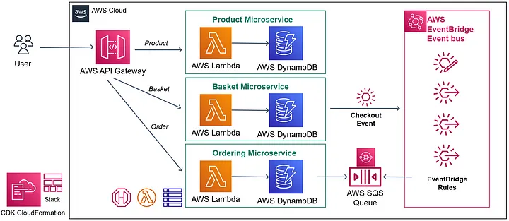

# AWS Serverless Microservices with Patterns & Best Practices

This repository contains my development and source code from the course AWS Serverless Microservices with Patterns and Best Practices by Mehmet Ozkaya.

## AWS Serverless Event-driven E-commerce Microservices



The `cdk.json` file tells the CDK Toolkit how to execute your app.

## Useful commands

- `npm run build` compile typescript to js
- `npm run watch` watch for changes and compile
- `npm run test` perform the jest unit tests
- `cdk synth` emits the synthesized CloudFormation template
- `cdk diff` compare deployed stack with current state
- `cdk deploy` deploy this stack to your default AWS account/region
- `cdk destroy` Destroys one or more specified stacks

## API Reference

#### Product Microservice

```http
  GET /product
```

```http
  GET /product/${id}
```

```http
  DELETE /product/${id}
```

```http
  POST /product
```

| Parameter     | Type     | Description |
| :------------ | :------- | :---------- |
| `name`        | `string` |             |
| `description` | `string` |             |
| `imageFile`   | `string` |             |
| `price`       | `number` |             |

```http
  PUT /product/${id}
```

| Parameter     | Type     | Description |
| :------------ | :------- | :---------- |
| `name`        | `string` |             |
| `description` | `string` |             |
| `imageFile`   | `string` |             |
| `price`       | `number` |             |

#### Basket Microservice

```http
  GET /basket
```

```http
  GET /basket/${userName}
```

```http
  DELETE /basket/${userName}
```

```http
  POST /basket
```

| Parameter  | Type     | Description |
| :--------- | :------- | :---------- |
| `userName` | `string` |             |
| `items`    | `array`  |             |

```http
  POST /basket/checkout
```

| Parameter       | Type     | Description |
| :-------------- | :------- | :---------- |
| `userName`      | `string` |             |
| `totalPrice`    | `number` |             |
| `firsName`      | `string` |             |
| `lastName`      | `string` |             |
| `email`         | `string` |             |
| `address`       | `string` |             |
| `cardInfo`      | `string` |             |
| `paymentMethod` | `number` |             |

#### Ordering Microservice

```http
  GET /order
```

```http
  GET /order/${userName}?orderDate=$(orderDate)
```

## Postman colletion

[Colletion Json](./postman)

## Documentation

[Documentation by Ozkaya](https://medium.com/aws-serverless-microservices-with-patterns-best/aws-serverless-architectural-patterns-and-best-practices-d2d446375924)

## License

[MIT](https://choosealicense.com/licenses/mit/)
